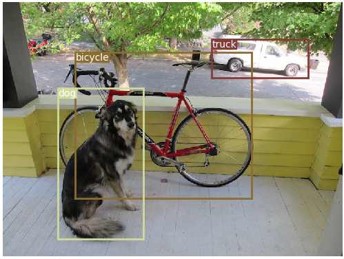

# 调用电脑摄像头进行实时物体检测
    
------------------------------------------------------------------------


### 目标检测模型使用的是YOLOv3，模型源码出自：https://github.com/eriklindernoren/PyTorch-YOLOv3

#### 如何使用已经训练好的YOLOv3模型进行实时目标检测？

##### 1.克隆本仓库
    $ git clone git@github.com:gcy506067668/YOLOObjectDetection.git

##### 2.安装需要的工具库
    $ cd YOLOObjectDetection/
    $ sudo pip3 install -r requirements.txt

##### 3.下载训练好的权重
    $ cd weights/
    $ bash download


##### 4.运行
    $ python mydetect.py


###### 我的测试示例
图片探测出自最右下载的视频，
用opencv画出来的探测框，没加颜色，很丑（-：

<p align="center"></p>

###### 以下是原作中的测试图

<p align="center"></p>
<p align="center"></p>
<p align="center"></p>
<p align="center"></p>


[[Paper]](https://pjreddie.com/media/files/papers/YOLOv3.pdf) [[Project Webpage]](https://pjreddie.com/darknet/yolo/) [[Authors' Implementation]](https://github.com/pjreddie/darknet)

```
@article{yolov3,
  title={YOLOv3: An Incremental Improvement},
  author={Redmon, Joseph and Farhadi, Ali},
  journal = {arXiv},
  year={2018}
}
```
